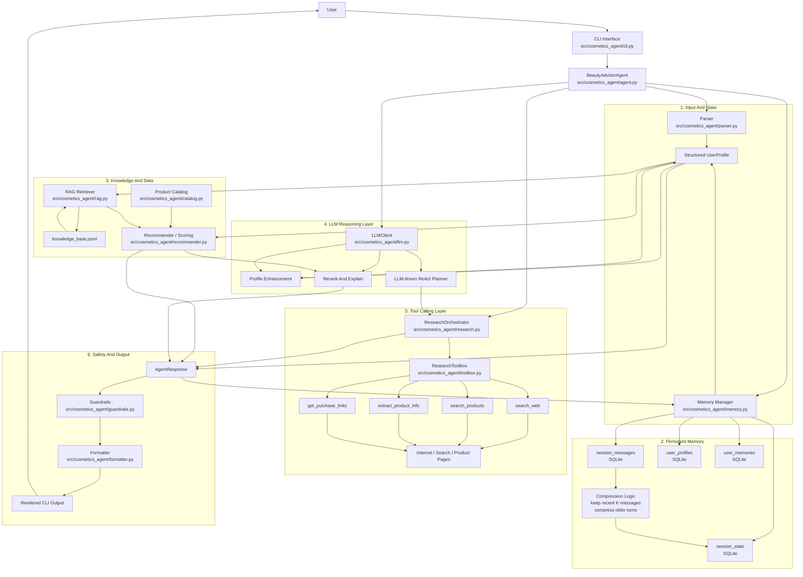
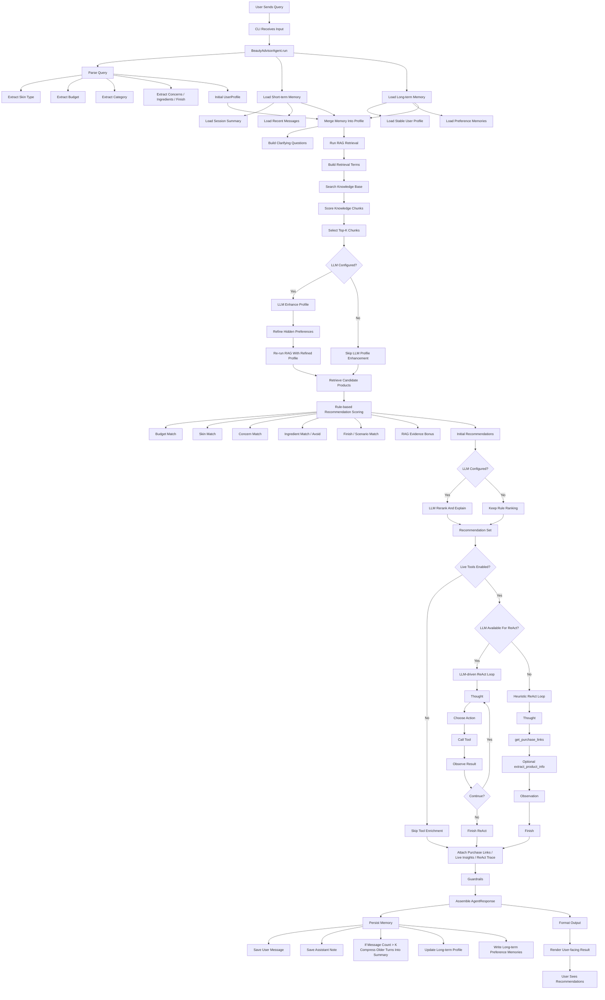

# Cosmetics Agent

一个可在本地 terminal 中运行的美妆导购 agent MVP。它会根据用户输入的肤质、预算、场景、功效诉求和成分偏好，给出护肤/彩妆推荐，并在信息不足时主动追问。

## 当前能力

- 解析中文自然语言需求
- 提取用户画像：肤质、预算、场景、功效、成分偏好/禁忌
- 从内置产品库筛选候选商品
- 从本地知识库做轻量 RAG 检索，补充推荐依据
- 用规则打分并生成推荐理由
- 支持接入 LLM API 做画像增强与候选复核，默认优先适配 OpenRouter 免费路由
- 支持 live tool calling：联网检索商品信息并补充购买链接
- 支持可观察的 ReAct 模式：展示思考摘要、动作和观察结果
- 支持 SQLite 持久化短期记忆与长期记忆
- 做基础安全检查，避免明显不合适的推荐
- 支持 CLI 本地测试

## 快速开始

```bash
PYTHONPATH=src python3 -m cosmetics_agent.cli chat --query "我是混油痘肌，预算300，想找清爽不闷痘的防晒"
```

进入交互模式：

```bash
PYTHONPATH=src python3 -m cosmetics_agent.cli repl
```

查看帮助：

```bash
PYTHONPATH=src python3 -m cosmetics_agent.cli --help
```

单独查看 RAG 检索结果：

```bash
PYTHONPATH=src python3 -m cosmetics_agent.cli kb --query "混油皮通勤底妆，预算300，想要雾面持妆"
```

如果你想省掉 `PYTHONPATH=src`，也可以先执行：

```bash
pip install -e .
```

## 记忆系统

当前内置了一个简单但完整的记忆层，默认落盘到：

`/Users/jieruiliu/Cosmetics-Agent/.cosmetics_agent/memory.db`

包含两类记忆：

- 短期记忆：按 `session_id` 保存最近消息；超过 `message_window` 后，旧消息会被压缩进会话摘要
- 长期记忆：按 `user_id` 保存稳定画像和偏好条目

示例：

```bash
PYTHONPATH=src python3 -m cosmetics_agent.cli repl --session-id demo-session --user-id demo-user --message-window 4
```

查看当前记忆：

```bash
PYTHONPATH=src python3 -m cosmetics_agent.cli memory --session-id demo-session --user-id demo-user --message-window 4
```

## 接入免费 LLM API

当前代码默认优先支持 `OpenRouter` 的免费路由，同时兼容 `Groq` 和 `Together` 的 OpenAI 兼容接口。

推荐先试 OpenRouter：

```bash
export LLM_PROVIDER=openrouter
export OPENROUTER_API_KEY=你的_key
export LLM_MODEL=openrouter/free
PYTHONPATH=src python3 -m cosmetics_agent.cli chat --query "我是混油痘肌，预算300，想找清爽不闷痘的防晒"
```

如果你想用 Groq：

```bash
export LLM_PROVIDER=groq
export GROQ_API_KEY=你的_key
export LLM_MODEL=openai/gpt-oss-20b
PYTHONPATH=src python3 -m cosmetics_agent.cli chat --query "我是混油痘肌，预算300，想找清爽不闷痘的防晒"
```

如果环境变量没配，程序会自动回退到纯规则 + RAG 模式。

## 开启 Live Tools

如果你想让 agent 联网查商品页和购买链接：

```bash
export LIVE_TOOLS_ENABLED=1
PYTHONPATH=src python3 -m cosmetics_agent.cli chat --query "混油皮，想找通勤底妆，预算300"
```

当前 live tools 提供这几个能力：

- `search_web`：查品牌、产品和网页资料
- `search_products`：查商品页
- `extract_product_info`：提取网页标题、摘要和价格线索
- `get_purchase_links`：给推荐结果补购买链接

开启 live tools 后，agent 会额外输出一段 `ReAct 轨迹`，方便你观察：

- 它为什么决定调某个工具
- 调完之后观察到了什么
- 为什么继续下一步或停止

说明：

- 这版 live tools 主要依赖公共网页搜索结果，适合学习和搭链路
- 返回链接时会尽量优先常见电商或品牌官网
- 如果网络不可用，agent 会保留原来的本地推荐，不会直接失败

## 系统设计

这一节用于帮助你从 agent 技术角度理解当前代码。建议直接在本地编辑器里打开本 README 查看 Mermaid 图，会比聊天窗口里更清楚。

### 系统架构图



### 端到端 Workflow 图



### 当前 Agent 技术和代码映射

- 多阶段编排：`src/cosmetics_agent/agent.py`
- 需求解析：`src/cosmetics_agent/parser.py`
- 短期记忆与长期记忆：`src/cosmetics_agent/memory.py`
- 本地知识库 RAG：`src/cosmetics_agent/rag.py`
- 规则推荐与排序：`src/cosmetics_agent/recommender.py`
- LLM 画像增强 / 复核 / ReAct：`src/cosmetics_agent/llm.py`
- Tool calling：`src/cosmetics_agent/toolbox.py` + `src/cosmetics_agent/research.py`
- Guardrails：`src/cosmetics_agent/guardrails.py`
- 最终可解释输出：`src/cosmetics_agent/formatter.py`

### 如何从学习角度阅读当前代码

推荐按这个顺序看：

1. `src/cosmetics_agent/agent.py`
2. `src/cosmetics_agent/models.py`
3. `src/cosmetics_agent/parser.py`
4. `src/cosmetics_agent/recommender.py`
5. `src/cosmetics_agent/rag.py`
6. `src/cosmetics_agent/memory.py`
7. `src/cosmetics_agent/toolbox.py`
8. `src/cosmetics_agent/research.py`
9. `src/cosmetics_agent/llm.py`
10. `src/cosmetics_agent/formatter.py`

## 推荐的下一步

- 把当前启发式 tool policy 升级成真正由 LLM 决策的 tool calling
- 把当前关键词检索升级为向量检索
- 增加产品库与成分库
- 持久化用户记忆
- 对接 API / Web 界面
